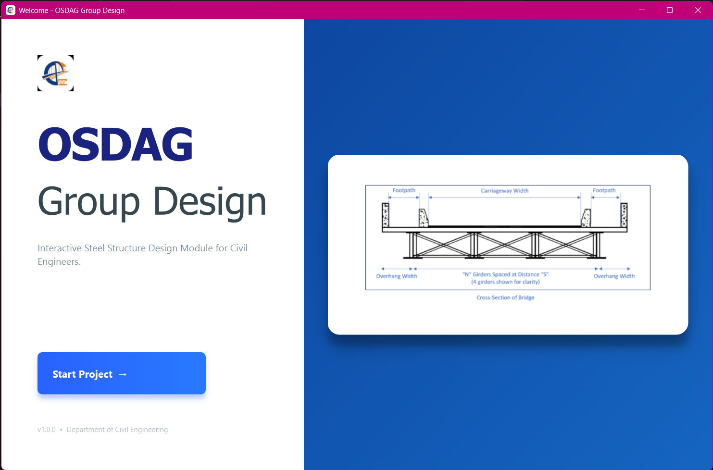
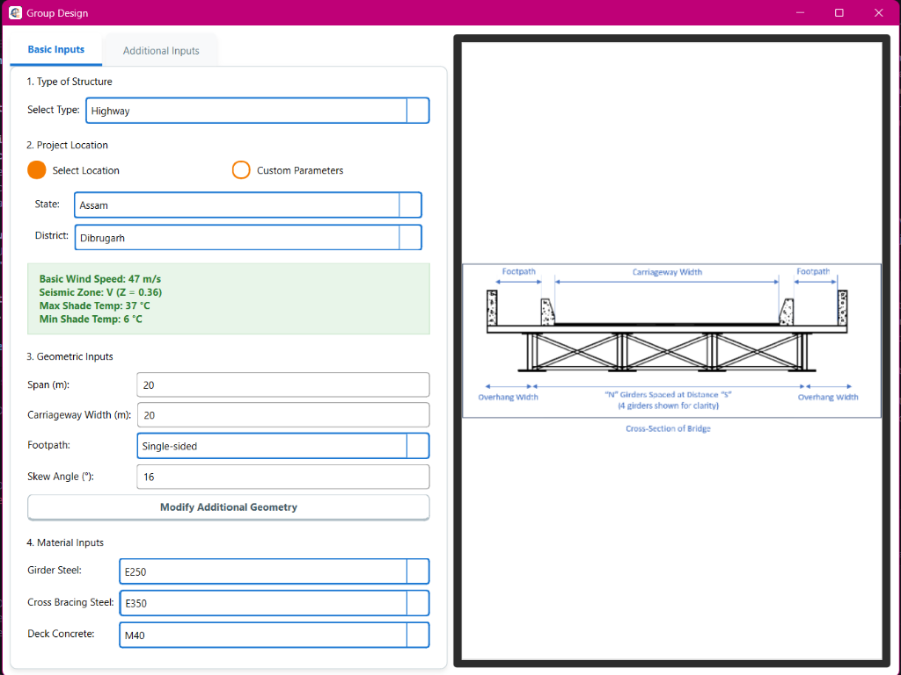
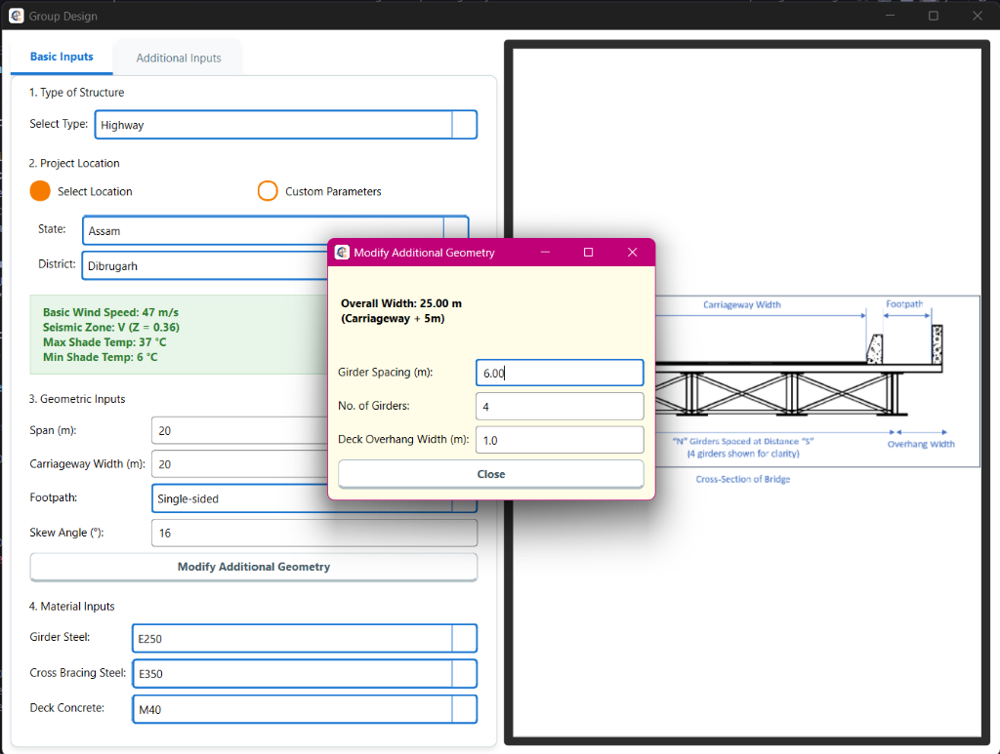

# OSDAG Group Design

A PyQt6-based bridge design module for OSDAG (Open Steel Design and Graphics). This application provides an intuitive interface for configuring bridge geometry, project location, and material properties.

## Features

- **Interactive UI**: Clean, responsive interface built with PyQt6.
- **Automated Data Retrieval**: Automatically fetches environmental data (Wind Speed, Seismic Zone, Temperature) based on selected Indian State and District.
- **Smart Geometry Input**: Intelligent "Modify Additional Geometry" tool that automatically balances Girder Spacing, Number of Girders, and Overhang width.
- **Validation**: Real-time validation for structural inputs (Span, Carriageway Width) with IRC-compliant warnings (e.g., Skew Angle).
- **Custom Loading**: Support for custom user-defined environmental parameters.

## Video Demonstration

<iframe width="560" height="315" src="https://www.youtube.com/embed/P3kY5P5_y8E" frameborder="0" allow="accelerometer; autoplay; clipboard-write; encrypted-media; gyroscope; picture-in-picture" allowfullscreen></iframe>


## Prerequisites

- **Python 3.10** or higher.
- Standard Python installation recommended (avoid MinGW/MSYS2 if possible to prevent PyQt6 compatibility issues).

## Installation

1.  **Clone the repository** (if you haven't already):
    ```bash
    git clone <your-repo-url>
    cd Osdag-desktop
    ```

2.  **Create a Virtual Environment**:
    ```powershell
    # Windows
    python -m venv venv
    ```

3.  **Activate the Environment**:
    ```powershell
    # Windows
    .\venv\Scripts\activate
    ```

4.  **Install Dependencies**:
    ```bash
    pip install -r osdag_group_design/requirements.txt
    ```

## Usage

Running the application:

```bash
python osdag_group_design/main.py
```

### Key Workflow
1.  **Type of Structure**: Select your structure type.
2.  **Project Location**: 
    - choose **Select Location** to pick a specific State/District.
    - View automatically populated environmental data (highlighted in green).
3.  **Geometric Inputs**: Enter Span and Carriageway width. Use "Modify Additional Geometry" to fine-tune girder details.
4.  **Material Inputs**: Select steel and concrete grades.

## Project Structure

```
osdag_group_design/
├── data/           # Database files (india_data.json)
├── ui/             # User Interface modules (PyQt6)
├── utils/          # Helper logic (Validators, Calculators)
├── assets/         # Images and icons
└── main.py         # Application entry point
```

## Database
The application uses a JSON database (`data/india_data.json`) to store and retrieve district-wise environmental data.

## Screenshots






